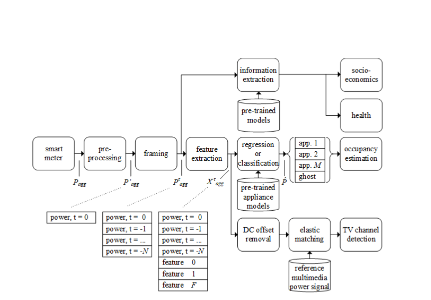

# Paper 3: Privacy and Security Threats from Smart Meters Technology

Key Topics : Consumer Privacy , NILM, Impacts of Misuse, Mitigation Strategies

---
# Introduction
- **Smart Meters**:
  - Measure and transmit household energy consumption data.
  - Benefits:
    - Accurate billing and energy management.
    - Supports grid optimization.
  - Risks:
    - Privacy and security vulnerabilities through data misuse.
---

# Non Intrusive Load Monitoring(NILM)
### Non-Intrusive Load Monitoring (NILM)
- **Definition**: Technique to disaggregate total energy usage into specific appliance-level data.
- **Inferred Data**:
  - Appliance usage.
  - Household occupancy patterns.
  - Socio-economic status and health-related habits.
  - Multimedia content consumption (e.g., TV channels).

---

---
### Examples of Misuse:
1. **Consumer Profiling**:
   - Insurance premiums adjusted based on socio-economic data.
   - Targeted advertising based on multimedia habits.
2. **Criminal Activity**:
   - Burglary risks due to real-time occupancy tracking.
   - Targeting high-value homes based on socio-economic profiles.

---

### Existing Policies:
- UK Smart Meters Act and Data Protection Act:
  - Limits data reporting to 30-minute intervals.
  - Mandates encryption, anonymization, and user consent.

### Proposed Mitigations:

1. **Policy Interventions**:
   - Strict regulations on data access and usage.
   - Ensuring utility providers maintain secure systems.
---
2. **Technical Measures**:
   - Signal filters and battery-based networks to obscure data.
   - Secure hardware with tamper-proof designs.
