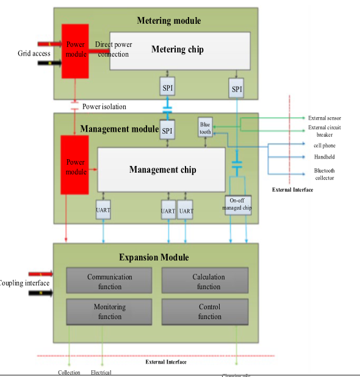

# Paper 4 : Analysis of Network Security Protection of Smart Energy Meter

---
# Introduction :
- The paper proposes a new smart energy meter design with modular architecture consisting of three main components:
    - Metering Module: Handles legal metering functions.
    - Management Module: Implements security and cost control.
    - Expansion Module: Supports communication, control, and monitoring based on various business needs.

---

---

## 1. Metering Module

**Purpose:**  
This module is responsible for the core function of the smart energy meter — measuring the electrical consumption.

**Components:**  
- **Metering Chip**: Captures real-time electricity data such as energy usage, voltage, and current. It can handle advanced functions like harmonic energy metering and minute freezing.  
- **Power Module**: Converts the 220V AC supply to DC power for the meter's operation.  

--- 
- **Battery**: The meter uses a replaceable battery to ensure continuous operation.

**Communication:**  
The metering module communicates with the management module via SPI (Serial Peripheral Interface).

**Key Function:**  
Accurate energy measurement and data collection for further processing and analysis.

---

## 2. Management Module

**Purpose:**  
This module manages the data from the metering module, controls the operations of the meter, and facilitates communication with external systems.
**Components:**  
- **Management Chip**: Handles intelligent functions like temperature measurement, software upgrades, intelligent display, and reporting of operational data.  
- **Power Conversion Module**: Provides DC power to the management chip.

---
**Communication:**  
- The management module communicates externally through Bluetooth with devices like mobile phones, handheld devices, concentrators, or external sensors.  
- It also connects to the expansion module via UART (Universal Asynchronous Receiver-Transmitter).

**Key Function:**  
Provides security features (e.g., encryption, authentication) and user interfaces, while also handling the control and monitoring functions.

---
## 3. Expansion Module

### Purpose:
The expansion module is designed to enhance the smart energy meter's capabilities by allowing it to integrate with various external devices and systems. It provides the flexibility to support additional use cases and functionalities, making the meter adaptable to different operational environments and customer requirements.

---

#### **Communication Functions:**
- The expansion module supports external communication interfaces, allowing the meter to connect to devices such as collection terminals, user electrical devices, and charging piles.
- It facilitates the interaction between the energy meter and other components in the energy management network, enabling real-time data exchange and control.

---

#### **Control Functions:**
- It enables the remote control of the meter's operation. This could include actions like turning devices on or off, adjusting settings, or triggering certain behaviors based on external conditions.
- The expansion module ensures that commands and control signals are sent securely and accurately between the meter and external systems, helping maintain effective management of energy consumption.

---

#### **Calculation Functions:**
- The module supports advanced data processing and calculation, which could include energy consumption analysis, cost control, and load distribution.
- It works in conjunction with the management module to process and analyze data, facilitating more efficient energy usage and optimization.

---

#### **Monitoring Functions:**
- The expansion module is responsible for monitoring the performance of the meter and the devices it is connected to. This could include tracking energy consumption patterns, detecting faults or anomalies, and ensuring the proper functioning of the overall system.
- It also provides real-time feedback and status updates to the central management system or user interfaces.

---
## Smart Power Network Structure
- The smart energy meters are part of a broader **smart power network** 
    - **Master Station Server**: Central control and management.
    - **Front-End Processors**: Handle local data processing.
    - **Cryptographic Devices**: Enhance security through encryption.
---
- The system allows for advanced **energy management services** like:
    - **Data Mining**
    - **Energy Consumption Analysis**
    - **Optimization**

- Meters are connected via **HPLC** (high-voltage power lines) and various communication protocols, ensuring:
    - **Real-Time Energy Management**
    - **Smart Grid Operations**

---
# Security Protection Mechanisms

- **Boundary Security**:  
  - Protects against unauthorized access and tampering.  
  - Uses encryption and data integrity algorithms (SM2, SM4).

- **Data Security**:  
  - Ensures confidentiality and integrity of stored and transmitted data.  
  - Uses SM1, SM4.  
  - **Data Storage**: Secured with **ESAM chips**.  
  - **Data Transmission**: Secured with encryption protocols.

---

- **Password Security**:  
  - Implements encryption for:  
    - **Identity Authentication**  
    - **Data Encryption**  
    - **Digital Signature Verification**  
  - Uses SM1, SM2, SM3, SM4.

- **Safety Monitoring & Management**:  
  - **Application-level Security Management**  
  - Divides security responsibilities among:  
    - Hardware, Software, Application Developers.
